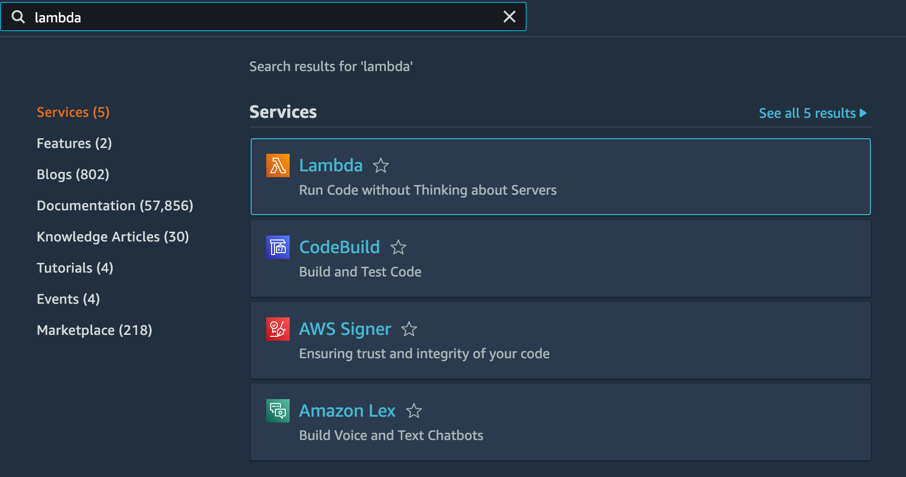
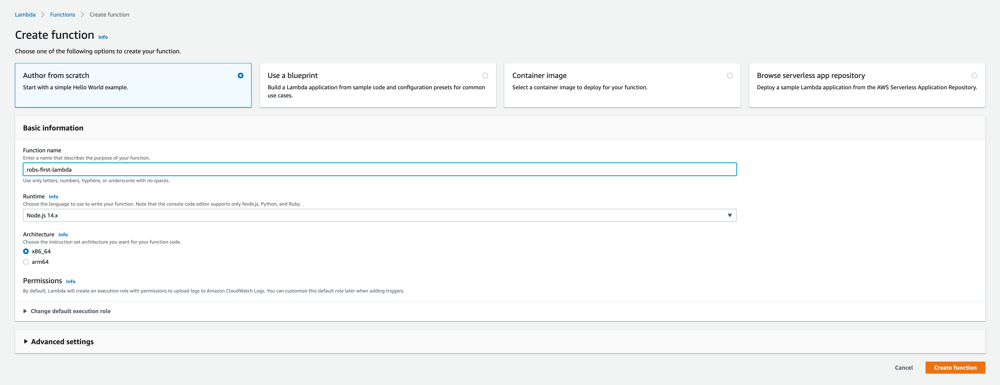
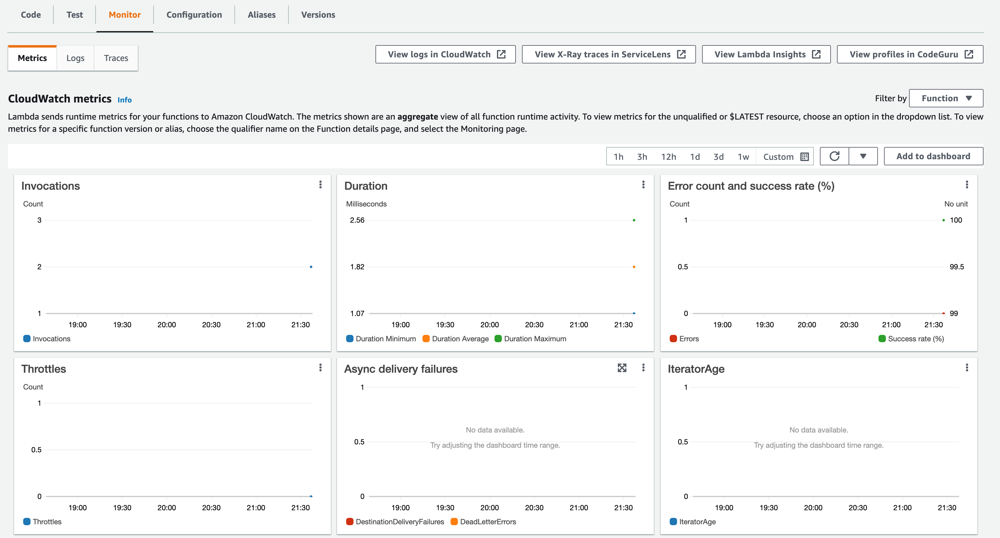

# Hello World

Before we start, set the region to `eu-west-1 (Ireland)` in the top-right corner. You can find more information on
regions [here](https://aws.amazon.com/about-aws/global-infrastructure/regions_az/).

## Creating a Lambda

### Go to the Lambda console

To navigate to the Lambda console,
use [this link](https://eu-west-1.console.aws.amazon.com/lambda/home?region=eu-west-1#/functions) or search for **
Lambda** in the top-left corner.



### Create a new NodeJS Lambda

Use the bright orange **Create function** button to create a new Lambda function. On the next page,
fill in the information to create the function **from scratch**. You can have a look at the other settings,
but there's no real need to change any of them.




### Write some code

Click the **Create function** button to create the function. On the next screen, you can write some
code for your Function. By default, you get the following

```javascript
exports.handler = async (event) => {
    // TODO implement
    const response = {
        statusCode: 200,
        body: JSON.stringify('Hello from Lambda!'),
    };
    return response;
};
```

The Lambda has 3 important parts:

- exports.handler: This is the function that Lambda calls when it executes the code. The function name
  can be changed in **Runtime settings**.
- event: The first function parameter (event) contains information about the invocation
  - HTTP event: the request path, request parameters, http headers…
  - Queue event: name of the queue, message on the queue, headers…
- response: This is the object that is returned to the requester. In our case, it is an HTTP response,
  which contains a response body, a status code and can contain some headers.

### Test the Lambda

When you've changed the code, use the **Deploy** button to store the changes on AWS. The code is now
deployed and ready to be executed. To execute your code, use the orange **Test** button.
When choosing a test event, *hello world* is sufficient for now. Later, we will use the 
*API Gateway AWS Proxy* event.

### View the logs

Under the **Monitor** tab, you can view metrics and logs of your recent invocations. Logging and monitoring
for Lambda is asynchronous, so it can take a minute before your data shows up.



## Introduction to Serverless

Setting up resources manually can be quite painful and time-consuming. AWS thought the same, so they came
up with a solution called [AWS CloudFormation](https://aws.amazon.com/cloudformation/). CloudFormation is
used to provision resources using *Infrastructure as Code*. For this application, we will be using
[Serverless](https://www.serverless.com/), a framework that leverages CloudFormation and comes with some
easy-to-use CLI tools.

### Set the credentials

You can copy the CLI credentials from the slides.

### Deploy the application

The resources for this application are defined in [serverless.yaml](../serverless.yaml). Before deploying
the application to AWS, you need to set a unique name in `serverless.yaml`, change `<name>` to your name.
Or be creative, I don't care.

```yaml
service: workshop-<name>
```

Serverless can be installed using **NPM** or **Yarn**.

```shell
# Use NPM
$ npm install

# Use Yarn
$ yarn
```

After installing the dependencies, you can deploy the application.

```shell
# Use NPM
$ npm run deploy

# Use Yarn
$ yarn deploy
```

### Test the application

A new Lambda has appeared with the name `<your-service-name>-dev-helloWorld`. It will execute just as
before.

### Deploying changes

Change the code in [hello_world.js](../code/hello_world.js) to return your own message. After you've
changed the code, run `npm run deploy` to deploy your changes to AWS. When you test your code now,
it will reflect your changes.
