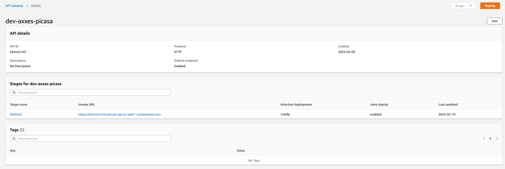
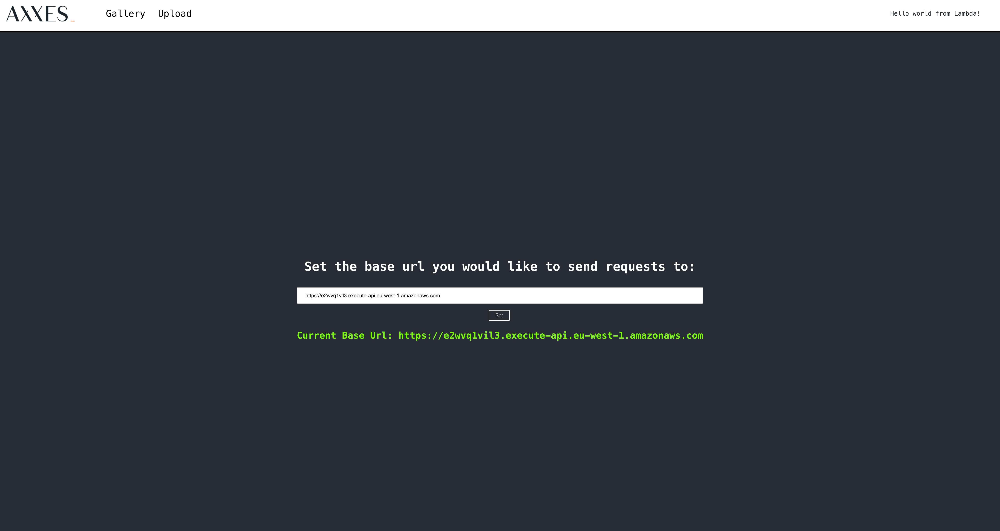

# Exposing an API

A Lambda on its own cannot be invoked from the outside. So for real world scenarios, this setup is
a bit limited. To expose our functionality for others to use, we need to expose some sort of API, in
this case HTTP.

## AWS HttpAPI

AWS provides a managed [API gateway](https://aws.amazon.com/api-gateway/) to expose your Lambda functions.
You can configure this using the console. But from now on, new resources will be created using Serverless.

### Add the API

Add the required configuration to `serverless.yaml` so your Lambda function can receive HTTP events.
You can find documentation about HttpApi [here](https://www.serverless.com/framework/docs/providers/aws/events/http-api).

<details>
  <summary>View solution</summary>

```yaml
functions:
  helloWorld:
    handler: code/hello_world.handler
    events:
      - httpApi:
          method: GET
          path: /hello
```

</details>

### Test the API

When you deploy your application, the output of the command will show your API Gateway URL. To view your
API in the console, navigate to the [API Gateway console](https://eu-west-1.console.aws.amazon.com/apigateway/main/apis?region=eu-west-1) and select your API.



### Integration with the UI

A web-based UI is already deployed at https://workshop.aws.axxes.com/. Enter your API URL on the landing
page and your message should display in the top-right corner. When this works, you're all set for the
next step.


