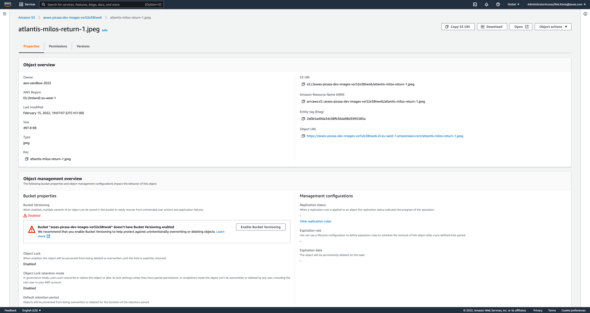
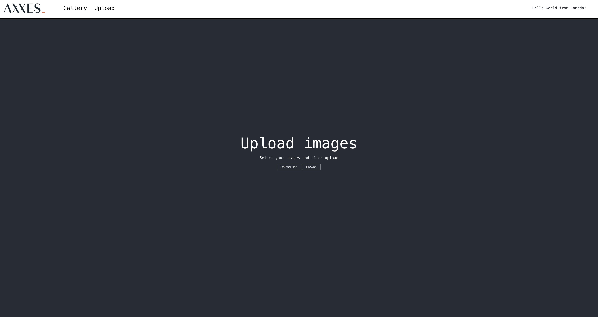

# Storing images

To upload a new image, we will need 2 steps:
- Store information about the image in a database
- Return a URL to which the user can upload an actual image

## The database

For the database, we will use [DynamoDB](https://aws.amazon.com/dynamodb/), a NoSQL database designed
for performance, without managing any servers.

### Create the database

Add the configuration to `serverless.yaml` to create a [DynamoDB Table](https://docs.aws.amazon.com/AWSCloudFormation/latest/UserGuide/aws-resource-dynamodb-table.html). You can find documentation
about extra resources [here](https://www.serverless.com/framework/docs/providers/aws/guide/resources).

A minimal configuration for a DynamoDB Table looks something like this

```yaml
Type: AWS::DynamoDB::Table
Properties:
  TableName: axxes-picasa-dev
  AttributeDefinitions:
    - AttributeName: "id"
      AttributeType: "S"
  KeySchema:
    - AttributeName: "id"
      KeyType: "HASH"
  BillingMode: PAY_PER_REQUEST
```

This will create a table with name **axxes-picasa-dev**, and a partition key on field `id`. This means 
that you could query your images using their **id**. Because `id` is used as partition key, it must be
unique. When you upload 2 images with id `image-1`, the first one will be overwritten. By setting
**BillingMode** to PAY_PER_REQUEST, you are only billed for request you make to the database.

<details>
  <summary>View solution</summary>

```yaml
resources:
    Resources:
      database:
        Type: AWS::DynamoDB::Table
        Properties:
          TableName: <your-table-name>
          AttributeDefinitions:
            - AttributeName: "id"
              AttributeType: "S"
          KeySchema:
            - AttributeName: "id"
              KeyType: "HASH"
          BillingMode: PAY_PER_REQUEST
```

</details>

### Create an item

Let's insert an item into the database. Navigate to the [DynamoDB Console](https://eu-west-1.console.aws.amazon.com/dynamodbv2/home?region=eu-west-1#dashboard)
and choose **Tables** in the menu on the left. Using the **Actions** menu on the top, create a new item.


`id` is the only required field of type `string`. For the other fields, you're free to insert what you
want.

To view your newly inserted item, the **Explore table items** button takes you where you need to be.

### Use DynamoDB

Extend your API by adding a second endpoint on `POST /upload`. You can use the setup in 
[upload.js](../code/upload.js), where the client for DynamoDB is already created. 
The UI sends the following body in the**POST** request.

```json
{"fileName": "image.png", "contentType": "image/png"}
```

and expects following response. (The contents of the response body don't matter for now, but it makes
validation easier).

```json
{"image": {}}
```

To use the `DocumentClient`, use [this documentation](https://docs.aws.amazon.com/AWSJavaScriptSDK/latest/AWS/DynamoDB/DocumentClient.html),
specifically [the put method](https://docs.aws.amazon.com/AWSJavaScriptSDK/latest/AWS/DynamoDB/DocumentClient.html#put-property).

<details>
  <summary>View solution</summary>

```yaml
functions:
    upload:
        handler: code/upload.handler
        events:
          - httpApi:
              method: POST
              path: /upload
```

```javascript
const AWS = require('aws-sdk');
const dynamodb = new AWS.DynamoDB.DocumentClient();
const s3 = new AWS.S3();

const uuid = () => Math.random().toString(26).slice(2);

exports.handler = async (event, context) => {
    const image = {
        id: uuid(),
        uploadedAt: new Date().getTime(),
        file: event.body.fileName,
        contentType: event.body.contentType
    };
    const response = await dynamodb.put({
        TableName: "axxes-picasa-dev",
        Item: image,
    }).promise();

    return {
        statusCode: 200,
        headers: {"content-type": "application/json"},
        body: JSON.stringify({
            image: image
        }),
    };
};
```

By using `uuid()`, you make sure that every image is unique and prevent updating images when you want
to create a new one.

</details>

## Storage

Storing images in a database is possible, but not very efficient. To store the actual binary image files,
we need to use some storage. For this, we can use [Amazon S3](https://aws.amazon.com/s3/).

### What is S3 ?

S3 is an object store built for resilience. Your data is automatically replicated across multiple
datacenters to prevent data loss in case of a failure. All without managing servers yourself.

### Create an S3 bucket with Serverless

Just like any other service on AWS, you can create it through the console. But it's tedious, so
we'll create it using Serverless. A minimal configuration for an S3 bucket looks like this.

```yaml
Type: 'AWS::S3::Bucket'
```

This single line of configuration will create an S3 bucket where you can upload and download objects.
But for our use case, this is not quite enough. To access the bucket from a website, you will need
to configure CORS using the `CorsConfiguration` property.

<details>
  <summary>View solution</summary>

```yaml
Resources:
  images:
    Type: 'AWS::S3::Bucket'
    Properties:
      CorsConfiguration:
        CorsRules:
          - AllowedHeaders: ['*']
            AllowedMethods: ['PUT']
            AllowedOrigins: ['*']
```

</details>

### Upload an image

Navigate to the [S3 Console](https://s3.console.aws.amazon.com/s3/home?region=eu-west-1#) and choose
your bucket. Use the orange **Upload** button to use the upload wizard. Choose whatever file you want
to upload. Images are a good choice, because you can view them in your browser later.

### View the image

Navigate back to your bucket and click on your newly uploaded image. Use the `Object URL` to view
the image in your browser.



By default, this is not allowed. All object in S3 are **private** by default. You can choose to
manage the permissions of objects individually, or you can make the entire bucket public. Add a policy
to the S3 bucket to allow public access.

<details>
  <summary>View solution</summary>

```yaml
Resources:
  bucketPolicy:
    Type: 'AWS::S3::BucketPolicy'
    Properties:
      Bucket: axxes-picasa-dev-images-vsr52e38two6
      PolicyDocument:
        Version: '2012-10-17'
        Statement:
          - Sid: Statement1
            Effect: Allow
            Principal:
              AWS: "*"
            Action: s3:GetObject
            Resource: arn:aws:s3:::axxes-picasa-dev-images-vsr52e38two6/*
```

This policy allows everyone (`AWS: "*"`) to perform the `s3:GetObject` action on all (`*`) objects in
your bucket. This allows your browser to retrieve the image you uploaded an show it in the browser.

</details>

### Generate a presigned URL

When you upload a file to an application, it blocks a thread of the application until the file is
fully uploaded. You can offload this functionality to S3. 
[S3 Presigned URLs](https://docs.aws.amazon.com/AmazonS3/latest/userguide/ShareObjectPreSignedURL.html)
are a way to give your user a URL on which they can perform actions for a certain period of time.
For example, you can give your user a URL to download a single object for 60 minutes. In our case
we will be giving the user a URL to `PUT` an object to. Extend the functionality in `upload.js` to
return a presigned url in the response to which the user can upload objects.

<details>
  <summary>View solution</summary>

```javascript
const url = s3.getSignedUrl('putObject',{
    Bucket: "axxes-picasa-dev-images-vsr52e38two6",
    Key: image.file,
    ContentType: image.contentType
});

return {
    statusCode: 200,
    headers: {"content-type": "application/json"},
    body: JSON.stringify({
        image: image,
        uploadUrl: url
    }),
};
```

</details>

### Test the API

Use the **Upload** page on the UI to upload an image using your presigned URL. After you have uploaded
your image, you can view it in the S3 bucket.


